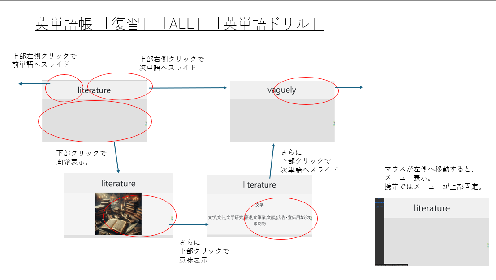

# 「エビングハウスの英単語帳＆メモ帳」

 [エビングハウスの忘却却曲線](https://ja.wikipedia.org/wiki/%E5%BF%98%E5%8D%B4%E6%9B%B2%E7%B7%9A)を参考にして、最適と思われるタイミング（１日後、７日後、２８日後）で、勉強内容を復習できるようにした英単語帳・メモ帳アプリ。<br><br><br>
  
  
### 作成の動機
- 大学受験に臨む息子の英語学習支援（⇒英単語イメージの画像化、複数単語の例文生成機能）。  
- 多岐にわたる学習をしていると、しばらくご無沙汰の分野が生じて記憶が曖昧になりがち。一定間隔を置いて復習できるメモ帳のようなアプリが個人的に欲しい。<br><br><br>

### 公開サイト
https://pure-reaches-08614-283f2e14249d.herokuapp.com/  
ID: guest  
password: guestguest  
　ログイン後、英単語帳ボタン（水色）をクリックし、復習ボタン（水色）をクリックすると英単語帳アプリが開始します。マウス操作により、画像・意味の表示、ページ遷移が発生します。  
<br><br>

### チュートリアル
##### 1.ＴＯＰ画面  
<br>
・英単語帳：マウスクリックで英単語・意味・イメージ画像が表示される英単語帳  
・英語例文帳：英単語帳の登録内容から自動作成された英語例文帳  
・メモ帳１：１クリックでページ遷移するメモ帳  
・メモ帳２：１クリックで解答が表示され、２クリックでページ遷移するメモ帳  
<br>
  
##### 2.エビングハウス英単語帳　
<br>
・中央の４つのボタンをクリックすると英単語帳アプリが起動します。  
・右サイドの英単語登録ボタンを押すと単語登録できます（英単語の意味はｗｅｂから自動取得）。  
・右サイドの編集ボタンを押すと、今までに登録した英単語を編集できます。  
<br>

##### 3.英単語帳　復習・ＡＬＬ・チェックリスト・ドリル画面  
<br>

（英語例文帳、メモ帳１、メモ帳２についてはマイナーチェンジなので説明を省略します。）  
<br><br><br><br>

### 使用技術
バックエンド：Python,Django,MySQL,RestframeWork  
フロントエンド：React,javascript,html,css  
サーバ：heroku  
バージョン管理：git (version 2.34.1)  
動作環境：Python 3.10.12, Node.js v20.17.0, npm 10.8.2    
開発環境: VSCode,Cursor,WSL2(ubuntu:22.04)  
<br><br><br><br>

### セットアップ  
### 1.バックエンド:MySQL,python,Django  
#### (1)MySQL(ubuntuの場合)  
 - システムパッケージの最新化  
```
sudo apt update  
sudo apt upgrade -y  
```
 - MySQLサーバのインストール  
（確認作業：sudo systemctl status mysqlでActivateの表示を確認）  

```
  sudo mysql_secure_installation  
```
 - MySQLへのログイン  
```
  sudo mysql -u root -p  
```

 - 新しいデータベースを作成  
```
  CREATE DATABASE my_database(任意);  
```
 - 新しいユーザ、パスワード設定  
```
  CREATE USER 'my_user(任意)'@'localhost（任意？）' IDENTIFIED BY 'my_password（任意）';
```   
 - 上記ユーザに権限付与  
```
  GRANT ALL PRIVILEGES ON my_database.* TO 'my_user(任意)'@'localhost(任意？)';  
  FLUSH PRIVILEGES;  
```
 - 終了（exit）  
  上記で入力した下記の４つのパラメータは、後述の.envファイル設定に記述。  
```
DB_NAME=my_database（任意）  
DB_USER=my_user（任意）  
DB_PASSWORD=my_password（任意）
DB_HOST=localhost（任意？）
```  

#### (2)Python,djangoの設定<br>
 Python 3.10.12をインストールする。  
 git cloneコマンドで、バックエンドソースコードを取得（masterブランチ）。
``` 
git clone https://github.com/goemon024/ebing_house.git
```
 pythonの仮想環境を有効化。
```
  python -m venv venv
  source venv/bin/activate
```
```
pip install -r requirements.txt 
```

 .envファイルを作成（詳細は、.env.exampleを参照）。 
 データベースのmigration<br>
```
  python manage.py migrate<br>
```

 （必要であればsuperuserの作成）
```
  python manage.py createsuperuser
```
<br><br>
### ２．フロントエンド：react <br>
 node.jsのインストール（2024年10月時点のLTS） 
```
  curl -fsSL https://deb.nodesource.com/setup_18.x | sudo -E bash -
  sudo apt-get install -y nodejs
```

 reactをインストールするフォルダを作成してgit cloneする(mainブランチ)。
```
   git clone https://github.com/goemon024/front.git<br>
```
 frontディレクトリに移行して、npm install
```
   cd front
   npm install
```
(.env.exampleファイルは原則不要です。ただし本番環境のためのnpm run buidl-deployを実行する場合には、build-deploy.shへの環境変数の入力が必要となります。このときは、build-deploy.shに、DJANGO_MANAGE_DIRと、PYENV_ACTIVATEを入力してください。)  <br><br>

### ３．開発環境、本番環境の立ち上げ
#### (1)開発環境  
 - backendのconfig/urls.pyの53行目のコメントアウトを解除し、47～49行目をコメントアウトしてください。これによりローカルにおいて、frontがlocalhost:3000に、backendがlocalhost:8000に立ち上がります。
 ```
 (backend)
   source venv/bin/activate
   python manage.py runserver
```
```
(frontend)
  npm start
```

#### (2)本番環境  
 - backendのconfig/urls.pyの53行目のコメントアウトし、47～49行目をコメントアウトを解除してください。これによりローカルにおいて、localhost:8000に立ち上がります。
 ```
(back end)
  source venv/bin/activate
  python manage.py runserver
(front end)
  npm run start
```
 - frontendの開発を本番環境に反映させる場合は下記のコマンドを入力します。build-deploy.shは、backendへのデプロイ処理を効率化するバッチであり、これによりfrontで構築されたbuildファイル群が、backendのstatic/reactフォルダ下に配置され,staticfilesフォルダが更新されます。
 ```
(front end)
  npm run build-deploy
```
<br><br><br><br><br>
### プロジェクト進捗管理（ガントチャート）
https://docs.google.com/spreadsheets/d/1zcICsNI8FeobAz0OJA_6ljW3WibZfMKnr55VtePGg04/edit?usp=sharing

<br><br>

### メモ
[作業・リファクタ・デバッグメモ](./document/開発.md)

<br><br>

### その他
#### １．本番環境のherokuサーバでは下記のバッチファイルがスケジュール実行されます。<br>  
‐ batch/batch_backup.py  
　データベースのバックアップ。  
‐ batch_guestdata_generate1.py, batch_guestdata_generate2.py  
　guestアカウントのためのデータ生成バッチファイル。
#### ２．OpenAIのAPIによる画像生成と例文生成について  
‐ batch/manual_openAI.py, batch/temp_mysql_update.py  
  これらのバッチファイルの手動実行により、openAIのAPIで英単語画像を生成。実行手順については省略。  
‐ batch2/sentence_generate.py, batch2/sentence_preprocess.py
　これらのバッチファイルの手動実行により、openAIのAPIで英語例文を生成。実行手順については省略。