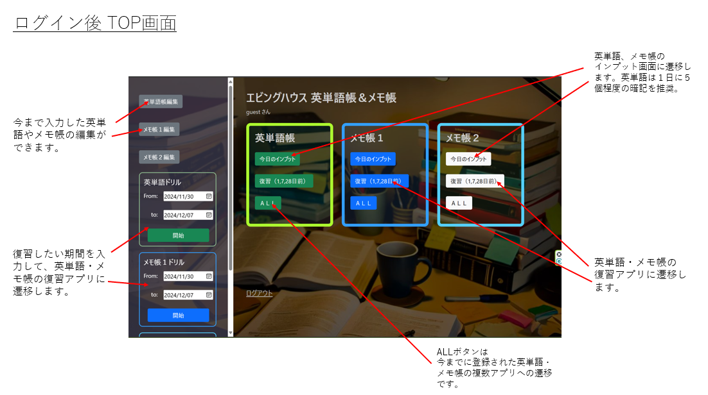
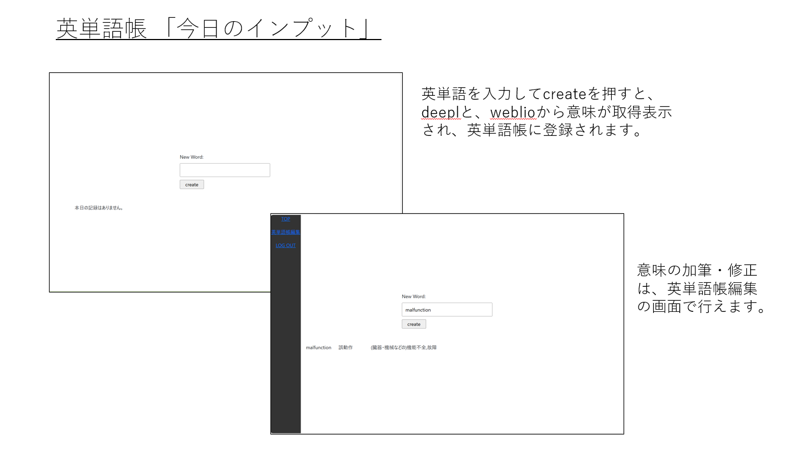

# 「エビングハウスの英単語帳＆メモ帳」

 [エビングハウスの忘却却曲線](https://ja.wikipedia.org/wiki/%E5%BF%98%E5%8D%B4%E6%9B%B2%E7%B7%9A)を参考にして、最適と思われるタイミング（１日後、７日後、２８日後）で、勉強内容を復習できるようにした英単語帳・メモ帳アプリ。   
  
  
### 作成の動機
- webエンジニアリングのような分野で多岐にわたる学習をしていると、しばらくご無沙汰の分野が生じて記憶が曖昧になりがち。一定間隔を置いて復習できるメモ帳が欲しい。
- 英語が苦手な息子の大学受験への活用（⇒単語イメージの画像化など機能拡充中）。   
- webエンジニアリングのような分野で多岐にわたる学習をしていると、しばらくご無沙汰の分野が生じて記憶が曖昧になりがち。一定間隔を置いて復習できるメモ帳が欲しい。
- 英語が苦手な息子の大学受験への活用（⇒単語イメージの画像化など機能拡充中）。   
  
### チュートリアル
1.ログイン後 ＴＯＰ画面
     
     
  
2.英単語　インプット画面（今日のインプット）
     
     
  
3.英単語帳　復習・ドリル画面
     
     
  
（メモ帳については、英単語帳のマイナーチェンジなので省略します）     

### 使用技術
  バックエンド：Python,Django,MySQL,RestframeWork  
  フロントエンド：React,javascript,html,css  
  サーバ：heroku  
  バージョン管理：git (version 2.34.1)  
  動作環境：Python 3.10.12  
           Node.js v20.17.0  
           npm 10.8.2  
  開発環境: VSCode, WSL2(ubuntu:22.04)  
 
### セットアップ  
1.バックエンド:MySQL,python,Django  
(1)MySQL(ubuntuの場合)  
・システムパッケージの最新化  
sudo apt update  
sudo apt upgrade -y  
・MySQLのインストール  
sudo apt install mysql-server -y  
（確認作業：sudo systemctl status mysqlでActivateの表示を確認）  
・セキュリティ設定（指示に従ってパスワード設定等）  
sudo mysql_secure_installation★  
・MySQLへのログイン  
sudo mysql -u root -p  
・新しいデータベースを作成  
CREATE DATABASE my_database;★  
・新しいユーザ、パスワード設定  
CREATE USER 'my_user'@'localhost' IDENTIFIED BY 'my_password';★  
・上記ユーザに権限付与  
GRANT ALL PRIVILEGES ON my_database.* TO 'my_user'@'localhost';  
FLUSH PRIVILEGES;  
・終了（exit）  
・後の、envファイルの設定のために控えておく。  
 
DB_NAME=my_database  
DB_USER=my_user    
DB_PASSWORD=my_password  
DB_HOST=localhost  
DB_PORT=3306  
 
(2)Python,djangoの設定  
・Python 3.10.12をインストールする  
・下記のgit cloneコマンドで、バックエンドソースコードを取得。  
git clone https://github.com/goemon024/ebing_house.git  
ブランチは、masterを利用。  
・pythonの仮想環境を有効化。  
python -m venv venv  
source venv/bin/activate   
・pip install -r requirements.txt  
・.envファイルを作成する。  
　詳細は、.env.exampleを参照のこと。  
・データベースのmigration  
python manage.py migrate  
（・必要に応じてsuperuserの作成）  
python manage.py createsuperuser  
 
２．フロントエンド：react  
・node.jsのインストール（2024年10月時点のLTS）  
curl -fsSL https://deb.nodesource.com/setup_18.x | sudo -E bash -  
sudo apt-get install -y nodejs  
・reactをインストールするフォルダを作成してgit clone  
・下記のgit cloneコマンドで、フロントエンドソースコードを取得。  
mkdir front  
cd front  
git clone https://github.com/goemon024/front.git   
ブランチは、mainを利用。  
・frontのディレクトリで、npm install  
・.envファイルを作成する。詳細は.env.exampleを参考。  
・（開発環境）npm start  
・（実行環境）npm build-deploy  
実行環境でのbackendへのデプロイ処理を効率化するため、build-deploy.shを活用している。このコマンドによりフロントで構築されたbuildファイル群が、backendのstatic/reactフォルダ下に配置されてstaticfilesフォルダも更新される。  
 
### 開発環境と実行環境について  
・開発環境にするときは、backendのconfig/urls.pyの53行目のコメントアウトを解除し、47～49行目をコメントアウトする。これによりローカルにおいてfrontがlocalhost:3000に、backendがlocalhost:8000に立ち上がる。  
・実行環境にするときは、backendのconfig/urls.pyの47～49行目のコメントアウトを解除し、53行目をコメントアウトする。これによりfront部分がbackendと共通ドメインのlocalhost:8000に立ち上がる。  
 
### その他  
１．herokuにて下記のバッチファイルがスケジュール実行される。  
・batch/batch_backup.py  
　ＤＢのバックアップファイルを形成する。  
・batch_guestdata_generate1.py, batch_guestdata_generate2.py  
　これらはデモンストレーションのため、アクティブなユーザの使用状況をguestIDで確認できるようにするためのものである。  
２．OpenAIのAPIによる画像生成について  
・batch_openAI.py,temp_mysql_update.py  
　現状ではopenAIによる英単語の画像生成は、息子のアカウントのみの適用としている。コスト面などの懸念からの試験的運用であり、これらのバッチファイルを手動実行させて画像生成をしている。    
３．携帯での英単語・メモ帳の編集画面表示について  
・表示レコード数が多いと、モーダルが開かずに強制終了する不具合があります（今回は対応しないため説明のみ）。        
