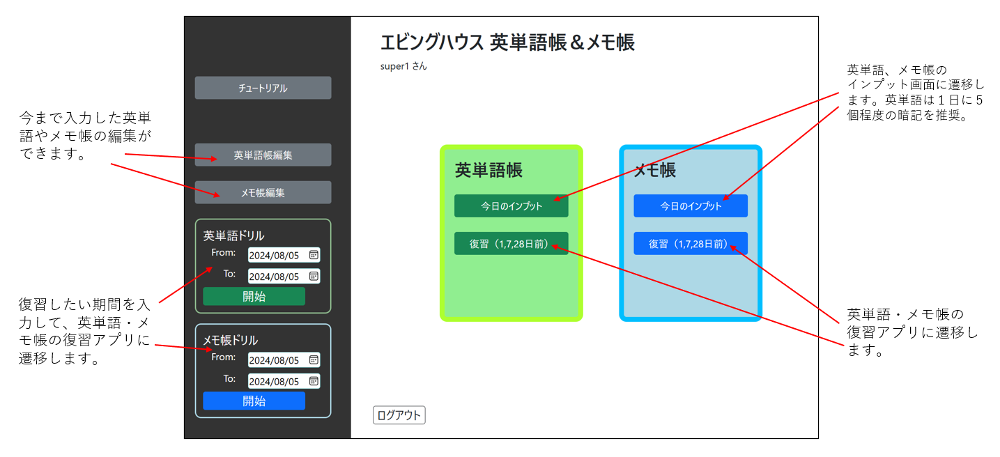
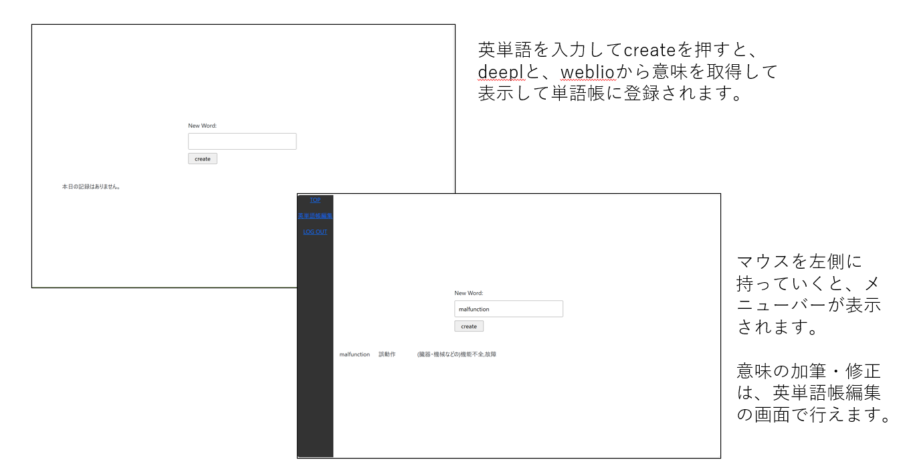
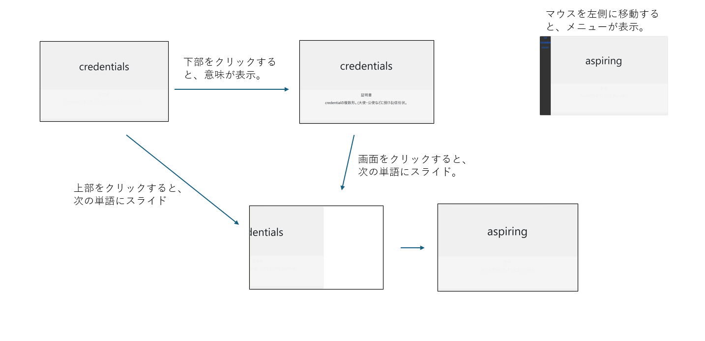

# ウェブアプリ名：エビングハウスの英単語帳＆メモ帳

 [エビングハウスの忘却却曲線](https://ja.wikipedia.org/wiki/%E5%BF%98%E5%8D%B4%E6%9B%B2%E7%B7%9A)を参考にして、最適と思われるタイミング（１日後、７日後、２８日後）で、勉強内容を復習できるようにした英単語帳・メモ帳アプリ。
  
  
### 作成の動機
- 多岐にわたる学習をしていると、しばらくご無沙汰の分野が生じて記憶が曖昧になりがち。
- 情報過多の時代、ネットやＳＮＳで有用な知識を得ても復習しなければ記憶に定着しない。
- 特に英単語は、頑張って覚えてもいつか忘れる。英語の学習習慣やモチベーションの管理が必要。
  
  
### 想定ユーザ
　自分。継続的な学習習慣や意欲のある人。
　同様のアプリは世間に存在するが、自分にとっての使いやすさを追求する。
  
### チュートリアル
1.ログイン後 ＴＯＰ画面

  
  
2.英単語　インプット画面（今日のインプット）

  

3.英単語帳　復習・ドリル画面

  

（メモ帳については、英単語帳のマイナーチェンジなので省略します）
  
  
